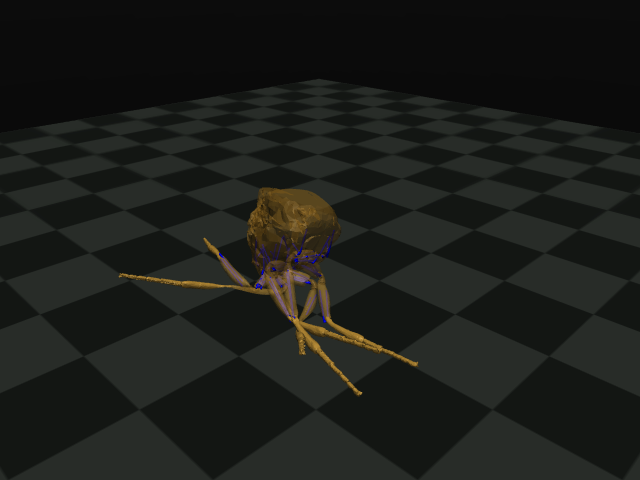

# Free six-leg muscle body: integrated, not behaving usefully

Update: [full-CNS rerun from a clearance-checked stance](STANCE_FEEDBACK.md)
removes gross initial overlaps and the drop start but still ends on the body,
not standing. Original trials below remain preserved.

A separate experimental body now has a free torso, 42 articulated leg degrees
of freedom and 90 muscle-tendon actuators. Full MaleCNS dynamics drive it through
named motor pools; physical tibia angles return through named claw afferents.
There is no gait oscillator, learned motor decoder or external posture policy.

**Result: the corrected run completes, but the animal rests on its body.**
Thorax and abdomen ground-contact forces are nonzero in every final condition.
Nearly upright body coordinates therefore do not establish standing, and no
useful walking, feeding, grooming or flight is demonstrated.

Subsequent [initialization audit](INITIALIZATION.md) finds 27 active inter-leg
contacts before floor contact, with penetration up to 0.1522 nominal mm.
Self-collision materially changes passive motion in matched 50-ms tests. This
is another mechanical confound, not evidence that CNS dynamics caused collapse.



This is a rendered physical pose from the positive-polarity feedback condition,
not an animation. Colors are static asset colors, not neural/muscle activity.

## What changed

`build_six_leg_muscles.py` replicates the pinned FlyMimic left-foreleg assembly
onto all six legs. Right assemblies are reflected; mounting positions come from
the source body, and fixed horizontal mounting directions come from the existing
Chreatures rig. The torso becomes free. Source right-leg locks are removed.
Original source files and the earlier whole-body experiment remain unchanged.

All muscle paths, force parameters, source joint limits, damping and armature
are retained. Shared attachment sites on the torso are transformed together with
each leg. Source tendon lengths at the reference pose agree within 7.5e-16.
Fourteen ±0.02-radian single-coordinate perturbations across all six copies
preserve tendon lengths within 1.2e-15 and moment arms within 4.8e-16.

This resolves the *coordinate-transfer problem* by carrying actual source
assemblies rather than relabeling mismatched joints. It is not a claim that
foreleg geometry is anatomically correct for middle or hind legs.

## Remaining approximations and omissions

- All six legs use identical foreleg geometry and muscle parameters. The model
  is not a measured six-leg reconstruction; the source itself is incomplete.
- Tarsal segments and non-leg parts remain rigid, as in the source asset.
  This alternative body cannot yet demonstrate articulated wings, feeding or
  the full non-leg behavior required by the overall goal.
- Of 90 muscle units, 78 have nonempty named motor pools. Twelve copied promotor
  units on middle/hind legs lack matching annotated pools and receive zero
  command. Their passive forces remain. No substitute neuron identities are invented.
- Only named claw-position inputs vary. Vision, odor, load sensing and other
  inputs remain neutral in this runner. The existing environment/sensory system
  has not been ported to this alternative body.
- Motor rates, shared recruitment, sensory tuning and serial homology remain
  uncalibrated approximations. No source PPO policy or recorded gait is used.
- Numerical body mass is 0.00245518 versus 0.00249427 in the source asset. No
  physically validated mass-unit interpretation or specimen match is asserted.

The original goal remains rich biologically grounded whole-fly behavior. This
body is an integration step, not a narrower replacement for that goal.

## Corrected experiment and evidence

`six-leg-feedback-002` ran six separate physical worlds: feedback, frozen senses
and zero motor commands for each of two sensory polarities. All use the full
165,122-neuron model, zero external context, and identical initial physical
states. Two simulated seconds took 121.9 wall seconds on the Vast host.

Final upright-axis components are 0.954–0.957, including zero-command controls.
Last-second horizontal paths are approximately 0.090–0.098 mm in driven/frozen
conditions and 0.022 mm with zero commands. These are not classified as walking.
Maximum feedback/frozen joint differences are 0.193 and 0.096 rad. Those differences
show sensitivity to feedback, not beneficial control.

Zero command is **not exact muscle paralysis**: source passive muscle forces
and minimum activation remain. Recorded peak actuator force in zero-command
lanes reaches 20.29 model units. Final force reconstruction shows body/abdomen
support, so apparent uprightness cannot be attributed to leg control.

Verification performed:

- Reconstructed every requested motor command from the recorded CNS rates within
  4.48e-8; zero commands and unassigned channels checked exactly.
- Reconstructed sensory transduction, identities and source hashes.
- Recorded full MuJoCo integration states, including muscle activation and solver
  warm starts. Thirty independently restored 10-ms intervals reproduce the next
  integration state exactly with their recorded controls. This is physical replay,
  not independent CNS regeneration.
- Repeated geometry-transfer checks on the corrected model and rendered the
  recorded final pose.

Receipts are `evidence/six-leg-body-002.json`, `six-leg-transfer-002.json`,
`six-leg-state-replay-002.json`, and `six-leg-feedback-verification-002.json`.
The actual numeric trace and controls are in `evidence/trials/six-leg-feedback-002`.

## Preserved construction failure

The first generator accidentally added a second coincident floor to the inherited
source floor. `six-leg-feedback-001` is retained as a **flawed scene**, not accepted
support evidence. Its source and verifier are preserved in commit `497078e`;
its issue note explains the mistake. The current generator checks for exactly
one inherited floor, and the runtime independently enforces that count.

Initial rendering also failed due to missing EGL/OpenGL loaders. Installing
Ubuntu `libegl1` and `libopengl0` enabled `MUJOCO_GL=egl` rendering. These libraries
did not change neural or muscle parameters. No simulation remains running.

## Reproduce

Use the existing pinned Chreatures and FlyMimic checkouts and MuJoCo 3.12.0.
The source XML and mesh assets are in the FlyMimic checkout. Generate into a
fresh directory; mesh copies are authenticated in the body receipt and are not
vendored in this repository.

```sh
.venv/bin/python build_six_leg_muscles.py \
  --xml ../FlyMimic/flymimic/assets/models/best_combined_cvt3.xml \
  --rig-scene ../chreatures/native/fly-body/scenes/training-4/world.json \
  --output runs/six-leg-body
CUDA_VISIBLE_DEVICES=0 .venv/bin/python run_six_leg_feedback.py \
  --source ../chreatures --model ../releases/chreatures-v5-garden/model \
  --xml runs/six-leg-body/six_leg.xml --body-receipt runs/six-leg-body/receipt.json \
  --motor motor-annotations.json --sensory proprioceptor-annotations.json \
  --output runs/six-leg-feedback --steps 200
```

`audit_six_leg_transfer.py`, `replay_six_leg_states.py` and `render_six_leg.py`
expose their arguments with `--help`. `verify_six_leg_feedback.py` verifies the
committed corrected trial and requires a fresh `--output` path. Historical
receipts are checked against their executed source revision, not future edits.
