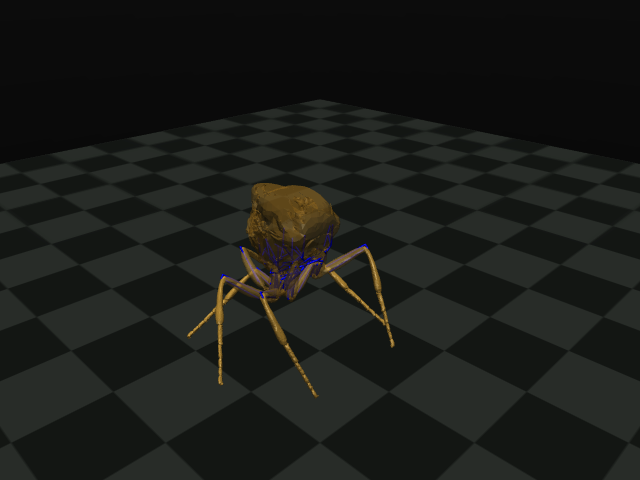

# Offline initial-stance search

**Update: refinement finds three geometrically acceptable poses, but bounded
muscle support remains infeasible in the static test.** These are saved offline
initial conditions, not a standing fly or a controller.



An initial bounded pose search changes only root height and the 42 leg joint
coordinates. It retains the published body, collision masks and all physical
parameters. It is not a runtime controller and does not test muscle support or
behavior. Three starts use root heights 1.3, 1.7 and 2.1 model units. The objective
penalizes engine-reported penetration and displacement of each distal tarsal
mesh bottom from the floor, with weak pose/foot-placement regularization.

`six-leg-stance-search-001` completes all three 120-evaluation searches. The
best maximum penetration decreases from the original 0.152218 to 0.000063826
model units, with all six foot-height errors below 0.000031. However, none meets
the declared geometric threshold (penetration <1e-5, foot error <1e-4). No
candidate has been installed in the embodied runner.

## Refinement and support gate

`six-leg-stance-search-002` refines the three saved poses without the weak
regularization toward the original pose/foot placement. No geometry, collision
mask, force parameter, or joint range changes. All three pass the original
geometric thresholds. Maximum penetrations are 1.83e-10, 2.00e-9 and 1.37e-8
model units; maximum foot-height errors are below 5.4e-9. Full `mj_forward`
collision checks independently confirm penetration below 1e-5 for each pose.
This demonstrates that the initial gross overlap can be removed by pose changes;
it does not require disabling self-collision or moving the hip mounts.

`audit_stance_support.py` tests gravity balance on all 48 generalized coordinates
at these poses, retaining passive forces. It gives each foot one ideal point
contact at its distal mesh's lowest vertex, with four tangential friction rays.
There is no torso/self-contact support, adhesion, or contact moment. This is an
ideal hard-contact calculation, not a proof of equilibrium with the runtime's
soft contact solver. Actual muscle forces are checked to be affine in activation
at the tested pose before forming the linear program.

| Available actuation | Feasible poses / 3 |
| --- | ---: |
| Passive forces only | 0 |
| All 90 muscles independently adjustable in [0,1] | 0 |
| Existing named motor pools adjustable in [0,1] | 0 |
| Independent muscle force extrapolated beyond activation 1 | 3 |
| Arbitrary signed torque on all 42 leg joints | 3 |

Under these pose/contact assumptions, muscle-force directions can support the
body, but physiological-range activation cannot. This is a **force-capacity
limitation at these poses**, not proof that no other stance works or a validated
measurement of biological muscle weakness. Replicated anatomy, parameter units,
length-dependent force, contact assumptions and pose selection remain relevant.
Do not blindly raise muscle gains or blame the CNS. The unbounded case is only
an algebraic extrapolation; no above-range command is sent to MuJoCo or the CNS.

Receipts `six-leg-stance-support-001.json` (bounded cases) and `-002.json`
(including the two relaxations) retain solver status and feasible solutions.
Executed source for initial search is git `b7d6a74`; initial bounded support
source is `d47464e`. Current source adds optional refinement and support
relaxations, so historical runner hashes refer to those executed revisions.

The first script attempt stopped before optimization because it incorrectly
assumed all source joint ranges were runtime-enforced. In fact only coxa roll
and tibia pitch are limited on each leg. The corrected search respects *all*
declared ranges as conservative offline search bounds, without changing physics.
The receipt records those ranges and runtime limit flags. No result file was
created by that failed attempt.

Geometric feasibility, if found, would only establish a better initial condition.
Static muscle/contact balance, passive dynamics, CNS feedback and rich behavior
remain separate requirements. Failure of a local search does not prove geometric
infeasibility.

Reproduce using the corrected body and the pinned MuJoCo installation:

```sh
OPENBLAS_NUM_THREADS=1 .venv/bin/python search_six_leg_stance.py \
  --xml runs/six-leg-body/six_leg.xml \
  --body-receipt runs/six-leg-body/receipt.json \
  --output runs/six-leg-stance-search.json
```

Add `--refine runs/six-leg-stance-search.json` and choose a fresh output to
refine prior poses. Test support using:

```sh
OPENBLAS_NUM_THREADS=1 .venv/bin/python audit_stance_support.py \
  --xml runs/six-leg-body/six_leg.xml --poses runs/refined-poses.json \
  --motor motor-annotations.json --output runs/stance-support.json
```
